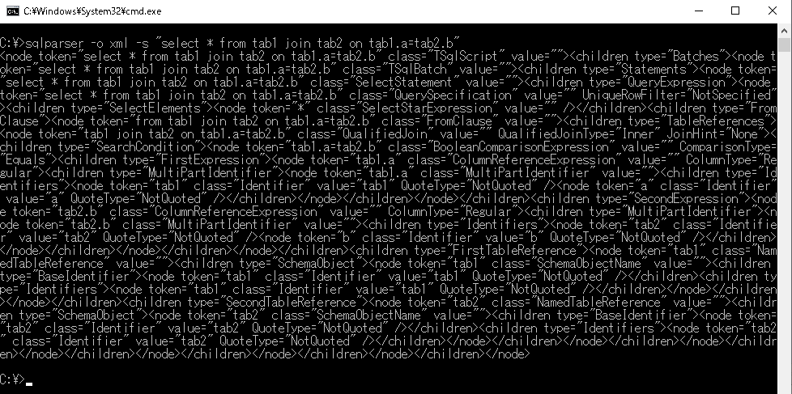
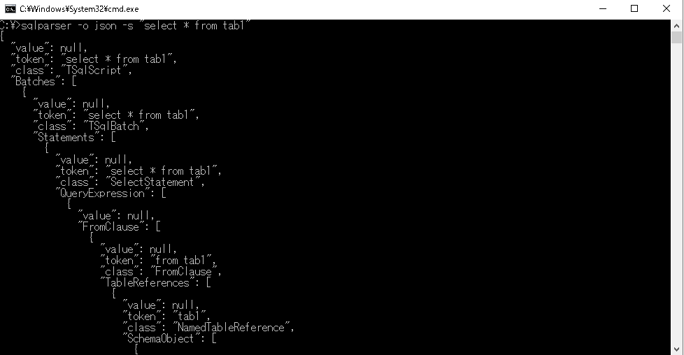

# TSQLScriptDomParser

<!-- # Short Description -->

TSQL parser with Microsoft SQL Server Transact-SQL ScriptDom.

<!-- # Badges -->

[](https://github.com/GCer-Hidenori/TSQLScriptDomParser/issues)
[](https://github.com/GCer-Hidenori/TSQLScriptDomParser/network/members)
[](https://github.com/GCer-Hidenori/TSQLScriptDomParser/stargazers)
[](https://github.com/GCer-Hidenori/TSQLScriptDomParser/)
[](https://github.com/GCer-Hidenori/TSQLScriptDomParser/)

# Tags

`tsql` `sql parser`

# Demo

sqlparser -o xml -s "select * from tab1 join tab2 on tab1.a=tab2.b"


  
sqlparser -o json -s "select * from tab1"



# Advantages

High accuracy of parsing because this program is made with MicrosoftR SQL ServerR Transact-SQL ScriptDom.  
https://www.microsoft.com/en-us/download/details.aspx?id=56833

# Installation

git clone https://github.com/GCer-Hidenori/TSQLScriptDomParser.git

# Minimal Example

## output format
- XML  
```sqlparser -o xml -s "select * from tab1 join tab2 on tab1.a=tab2.b"```
- json  
```sqlparser -o json -s "select * from tab1 join tab2 on tab1.a=tab2.b"```
## input format
- string  
```sqlparser -o json -s "select * from tab1 join tab2 on tab1.a=tab2.b"```
- file  
```sqlparser -o json -f select01.sql -e utf-8```

# Contributors

- [GCer-Hidenori](https://github.com/GCer-Hidenori)

<!-- CREATED_BY_LEADYOU_README_GENERATOR -->
